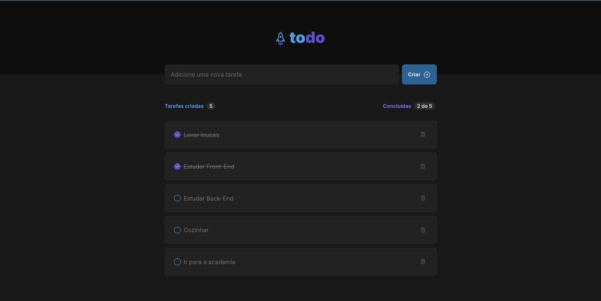
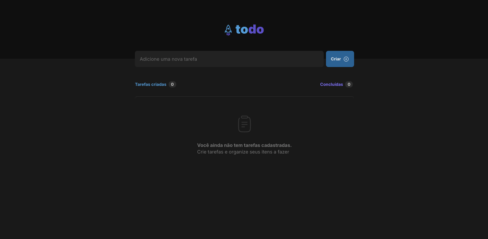

# ToDo List - React Challenge

This is a React.js project developed as part of a challenge proposed by Rocketseat. The goal of this project was to reinforce fundamental React concepts by building a simple and functional To-Do List application.

## 🚀 Features

- Add new tasks
- Mark tasks as completed
- Delete tasks
- Task counter (total and completed)
- Interactive UI with a modern and responsive design

## 🖥️ Preview

Check out the project design on Figma: [ToDo List Figma Design](https://www.figma.com/design/LVVGqDk0GHFVCRRIz2l9Jn/ToDo-List-%E2%80%A2-Desafio-React-\(Copy\)?node-id=56-96\&p=f\&t=afdXB7ZnJCiMyq5Z-0)

## 📦 Tech Stack

- React.js
- Vite
- TypeScript (if applicable)
- CSS Modules
- Phosphor Icons

## 🛠 Installation & Usage

### Clone the repository:

```bash
git clone https://github.com/ThauanyAA/TodoList.git
cd todo-list-react
```

### Install dependencies:

```bash
npm install
# or
yarn install
```

### Run the application:

```bash
npm run dev
# or
yarn dev
```

Then, open your browser and go to `http://localhost:5173`.

## 🎯 Challenge Instructions

This project follows the challenge proposed by Rocketseat. You can find the challenge details here: [Challenge Instructions](https://efficient-sloth-d85.notion.site/Desafio-01-Praticando-os-conceitos-do-ReactJS-91fd63dd1a5b4a2796152de293ec1074)

## 📸 Screenshots

### Without Tasks


### Task List with Completed Items


## 📜 License

This project is licensed under the MIT License - see the [LICENSE](LICENSE) file for details.

---

Made with 💜 by [Thauany](https://github.com/ThauanyAA) 🚀

